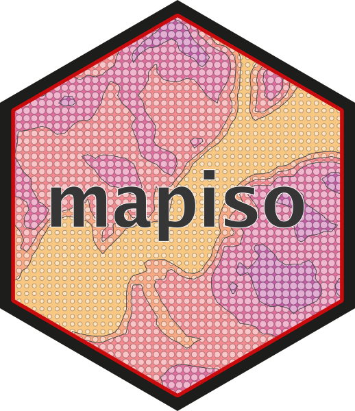

<!-- README.md is generated from README.Rmd. Please edit that file -->

```{r, include = FALSE}
knitr::opts_chunk$set(
  collapse = TRUE,
  comment = "#>",
  fig.path = "man/figures/README-",
  out.width = "80%"
)
```

# mapiso 

<!-- badges: start -->
[](https://www.repostatus.org/#active)
[](https://github.com/riatelab/mapiso/actions/workflows/R-CMD-check.yaml)
[](https://app.codecov.io/gh/riatelab/mapiso?branch=main)
<!-- badges: end -->

The goal of `mapiso` is to ease the transformation of regularly spaced grids containing continuous data into contour polygons.
These grids can be defined by data.frames (x, y, value), `sf` objects or SpatRasters from `terra`.  
`mapsio` is a wrapper around [`isoband`](https://wilkelab.org/isoband/).


## Installation

You can install the development version of `mapiso` from GitHub with:

``` r
remotes::install_github("riatelab/mapiso")
```


## Usage


### Raster

```{r raster}
library(mapiso)
library(terra)
library(mapsf)
r <- rast(system.file("tif/elevation.tif", package = "mapiso"))
isor <- mapiso(x = r)
mf_theme(mar = c(0, 0, 0, 0))
mf_raster(r)
mf_map(isor, col = NA, add = TRUE)
```

### sf regular grid

```{r sf}
library(mapiso)
library(sf)
library(mapsf)
# gridded data
s <- st_read(system.file("gpkg/elevation.gpkg", package = "mapiso"), 
             layer = "elevation", quiet = TRUE)
# mask
m <- st_read(system.file("gpkg/elevation.gpkg", package = "mapiso"),
             layer = "com", quiet = TRUE)
# custom breaks
bks <-c(98,100, 150, 200, 250, 300, 350, 400, 412.6) 
isos <- mapiso(x = s, var = "elevation", breaks = bks, mask = m)
mf_map(isos, "isomin", "choro", 
       breaks = bks, border = NA, 
       leg_title = "elevation")
mf_map(m, col = NA, add = TRUE)
mf_map(s, cex = 1, pch = ".", col = "grey20", add = TRUE)
```

### data.frame

```{r data.frame}
library(mapiso)
library(mapsf)
d <- read.csv(system.file("csv/elevation.csv", package = "mapiso"))
head(d)
isod <- mapiso(x = d, var = 'elevation', coords = c('x', 'y'), crs = 'epsg:2154')
bks <- unique(c(isod$isomin, isod$isomax))
mf_map(isod, "isomin", "choro", breaks = bks, leg_title = "elevation")
```


## Community Guidelines

One can contribute to the package through [pull
requests](https://github.com/riatelab/mapiso) and report issues or
ask questions [here](https://github.com/riatelab/mapiso/issues).  
This project uses [conventional
commits](https://www.conventionalcommits.org/en/v1.0.0-beta.3/) and
[semantic versioning](https://semver.org/).
